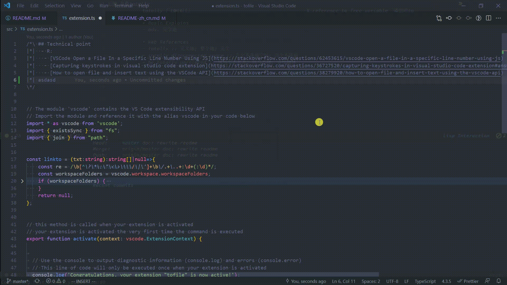

#  tofile 
## [English](https://github.com/WingDust/tofile) | 简体中文

## 项目定义
  - 为方便本项目将文件下面的中双箭头模式区域称为 `Fragment` 
  ```txt
  /*\ ## Technical point
  |*|  - R:
  |*|   - [VSCode Open a File In a Specific Line Number Using JS](https://stackoverflow.com/questions/62453615/vscode-open-a-file-in-a-specific-line-number-using-js)
  |*|   - [Capturing keystrokes in visual studio code extension](https://stackoverflow.com/questions/36727520/capturing-keystrokes-in-visual-studio-code-extension#answer-36753622)
  |*|   - [How to open file and insert text using the VSCode API](https://stackoverflow.com/questions/38279920/how-to-open-file-and-insert-text-using-the-vscode-api)
  \*/
  ```

## 特性
  1. 使用命令 `tofile` 时，将探测当前光标这一行中含相对路径的字符串（像 `src/a.ts:2` 其中 `2` 为行号），并尝试进行在 VSCode 中打开跳转
  > **通过命令调用（<F1> 输入tofile）tofile 将会对当前光标这一行检索含有相对路径写法的字符串来进行用 VSCode 打开这个文件，也就跳转 jump**
  
  2. 补全 `Fragment` 
  
    - 已知问题
      - 在普通打字删除前面的 `|*|` 将会出现 （在 Vim 普通模式下没有这个问题 ）
      
      - 解决方案：普通打字选中整行并删除
      
      - 为什么有这个问题
        > 1. vscode 不支持多个扩展注册 type 命令，它导致只能一个扩展能细粒控制键盘事件

        > 2. 而我不想将 tofile 写得那么复杂
        - [Multiple extensions registering the 'type' command](https://github.com/microsoft/vscode/issues/13441)

## 当使用仓库中的脚本时会有的依赖，使用 VSCode 扩展 tofile 本身无依赖
  - `src/script/fragment.ts` 依赖 `ts-node` `ripgrep`
  - `yarn fragment` 和 `npm run fragment`  将会生成 `ts-Fragments.md`(文件后缀名 + Fragment.md) 在项目根目录. 项目也一个例子.
  - `yarn fragment` 和 `npm run fragment` 的脚本是 `ts-node -P ./tsconfig.json ./src/script/fragment.ts ts`,当你使用这个ts脚本时,需要指定 `tsconfig.json`，脚本的路径 和一个文件后缀名类型 ,这里是 `ts`

### Fragment 使用注意
  - 当使用字面量正则表达式 `*/` 将会报错
    - **Can't use literal Regex**
      - 报错例子
      ```ts
      /*\ ## only match space
      |*|  '  \n'.match(/^\x20*/
      \*/
      ```
      - 解决方案：使用变通方法来表达
      ```ts
      /*\ ## only match space
      |*|  ```ts
      |*|  '  \n'.match(new RegExp(String.raw`^\x20*`))
      |*|  ```
      \*/
      ```
  
## 建项原因
  - 当你在写大型的项目时，会遇见林林总总各式各样的问题。
  - 通常来说，都是通过搜索引擎来找寻相似问题的答案来做参考，（当自己就能解决了，就会省去这一步，然而往往问题的解决方案不只一个。也经常会出现要注意的事）
  - 将上面几个要点抽离出来就成
    - 问题
    - 多个解决方案
    - 参考
    - 注意事项
  - 这几样东西完全可以通过规范的 Markdown 格式来做一个模版
  ```md
  > Q: Question （问题）

  > A: Answers （解决方案）

  > R: Reference （参考）

  > N: Note （注意事项）

  ## 怎么中断 for 
    - A: 
      - aaaa
    - N:
      - aaaa
    - R:
      - [中断for](https://****.com)
      - [中断for](https://****.com)
  ```
  - 也能简写成通过 **没写代表目前没有这个**，
  ```md
  ## 怎么中断 for 
    - R:
      - [中断for](https://****.com)
      - [中断for](https://****.com)
  ```
  - 然而这个只是在 Markdown 文件适用，而且这个模版写法只是记录下事情问题的规律，当没有这个问题发生时，就会变费力还没有用
  - 所以我想不对现有的情况做出大的改变，而又建立的新的写法习惯。
  - 这个新的写法习惯就是将上面的 Markdown 中的模版写法，写入进代码注释中
  - 这个使用 snippet 就是容易就做到的一件事 （如 vscode snippet）
  - 上面的 Markdown 中的模版写法，写入代码文件中，有**一点好处**
    - QARN (Question,Answers,Reference,Note) 与代码在一个地方，**化零为整**。
    - **项目的正确则代表问题有解**
    - **快速 深入代码** 这很 native
  - 然而将上面的 Markdown 中的模版写法，写入进代码注释中的**缺点**就是
    - 将各个林林总总的问题分散到项目中各个小文件中去了，不利于**检索、汇总记录**
  - 所以也就有了这个项目 tofile
  - 通过 `ripgrep` 抽出各个代码文件中的问题，并记录下文件在项目中的位置，并生成一个具有目录性质的 Markdown 文件。
  - 上面这个事通过任意的脚本都是很容易做到的，
  - 但这个脚本是只是 **汇总记录** **检索**应该放到编辑器行为。
  - 所以 tofile 来做这个