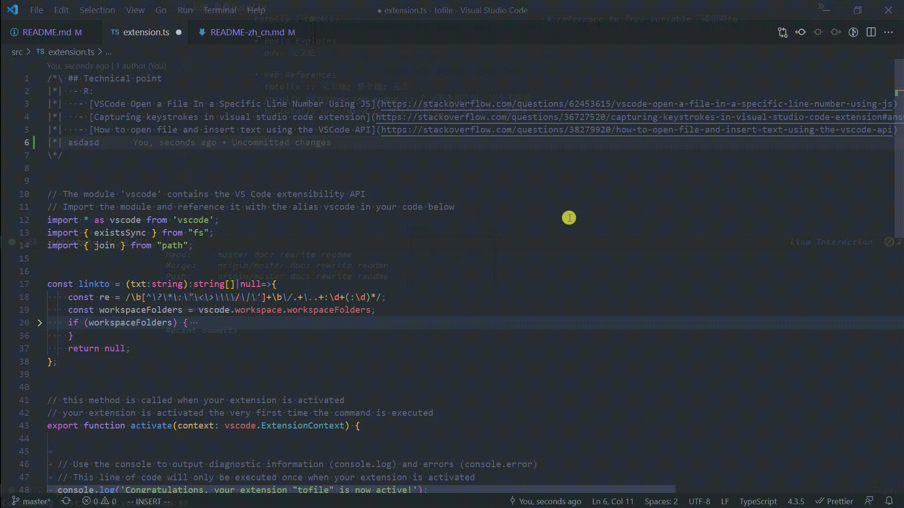

# tofile README
## English | [简体中文](https://github.com/WingDust/tofile/blob/master/README-zh_cn.md)

> This Plugin for script that generate Fragments markdown file content with file location
> This Plugin do thing is goto file location with current cursor


## self defined for easily to named
  - we will call below code block is `Fragment`
  ```txt
  /*\ ## Technical point
  |*|  - R:
  |*|   - [VSCode Open a File In a Specific Line Number Using JS](https://stackoverflow.com/questions/62453615/vscode-open-a-file-in-a-specific-line-number-using-js)
  |*|   - [Capturing keystrokes in visual studio code extension](https://stackoverflow.com/questions/36727520/capturing-keystrokes-in-visual-studio-code-extension#answer-36753622)
  |*|   - [How to open file and insert text using the VSCode API](https://stackoverflow.com/questions/38279920/how-to-open-file-and-insert-text-using-the-vscode-api)
  \*/
  ```
## Features
  1. When call `tofile` ,will detect relate file path string (like `src/a.ts:2` 2 mean line number) in current cursor line ,And try to jump to file .
  
  2. complete `Fragment`
  

    - knowed problem
      - In Normal type (include Vim Insert mode,but Vim Normal mode is work fine) to delete `|*|` will be
      
      - fix: Normal type need select totally line and delete 
      
      - Why has this problem
        > 1. vscode don't support Multiple extensions registering the 'type' command, it cause only one extension can fine grain-size to control keystrokes event.

        > 2. I don't want make `tofile` complex
        - [Multiple extensions registering the 'type' command](https://github.com/microsoft/vscode/issues/13441)


## When you want to use fragment script in this repo, has Requirements
  - `src/script/fragment.ts` dependencies `ts-node` `ripgrep` 
  - `yarn fragment` and `npm run fragment`  will generate `ts-Fragments.md`(file suffix + Fragment.md) in project root path. Project also have one.
  - `yarn fragment` and `npm run fragment` script is `ts-node -P ./tsconfig.json ./src/script/fragment.ts ts`, When you use it, you need specify `tsconfig.json`, script path and a kind  of file suffix as parameter ,this is `ts`

### Fragment Notes 
  - When you use literal Regex `*/` in code  will Error
    - **Can't use literal Regex**
      - Error example
      ```ts
      /*\ ## only match space
      |*|  '  \n'.match(/^\x20*/
      \*/
      ```
      - fix: use RegExp or like it something else
      ```ts
      /*\ ## only match space
      |*|  ```ts
      |*|  '  \n'.match(new RegExp(String.raw`^\x20*`))
      |*|  ```
      \*/
      ```

## Reason for Project
  - When you write a giani Project , You will meet various problem
  - In generally, Find out by search engine,or you self can do it. But mostly answer is not one. And sometime will has note movtion.
  - So can extract 
    - Question
    - Answers
    - Reference 
    - Note
  - these stuff totally can use templete markdown to explain
  ```md
  > Q: Question 

  > A: Answer 

  > R: Reference 

  > N: Note 

  ## how to break for 
    - A: 
      - aaaa
    - N:
      - aaaa
    - R:
      - [break for](https://****.com)
      - [break for](https://****.com)
  ```
  - Also we can simplify by **don't write mean current don't have**
  ```md
  ## how to break for 
    - R:
      - [break for](https://****.com)
      - [break for](https://****.com)
  ```
  - Howover, this only can use in markdown file . And this templete write only just record problem rule. When problem never meet , This markdown file will useless and in vain.
  - So , I want to this templete write embed in code comment file like TypeScript/JavaScript
  - Use snippet is easy to archive like vscode snippet
  - embed in code comment: **good stuff**
    - QARN (Question,Answers,Reference,Note) record and code in one place, **gather parts into a whole**
    - **Poject is right mean Question has Answers**
    - **quick deep into** it totally native
  - embed in code comment: **bad stuff**
    - all questions is separate in various file ,
    - hard to **search**
    - hard to **collect**
  - So have `tofile`
  - extract all specify type file 's `Fragment` ,and record file line number by `ripgrep` ,finally generate a catalog markdown file
  - above thing various script language can do it
  - but script do **collect** is fine, **search** should be editor movtion.
  - so `tofile` do it 
### Reference
  - [activationEvents.workspaceContains doesn't fire for directory](https://github.com/Microsoft/vscode/issues/2739)
  - [Insert a space after the line comment token and inside the block comments tokens](https://github.com/microsoft/vscode/blob/e5b6f39005e6029d6655e89313c8118bfda0913f/src/vs/editor/common/config/editorOptions.ts#L1136)
  - [vscode-box-comment](https://github.com/mattkenefick/vscode-box-comment)
  - [better-comments](https://github.com/aaron-bond/better-comments)
  - [comment-vscode](https://github.com/pouyakary/comment-vscode)

**Enjoy!**
