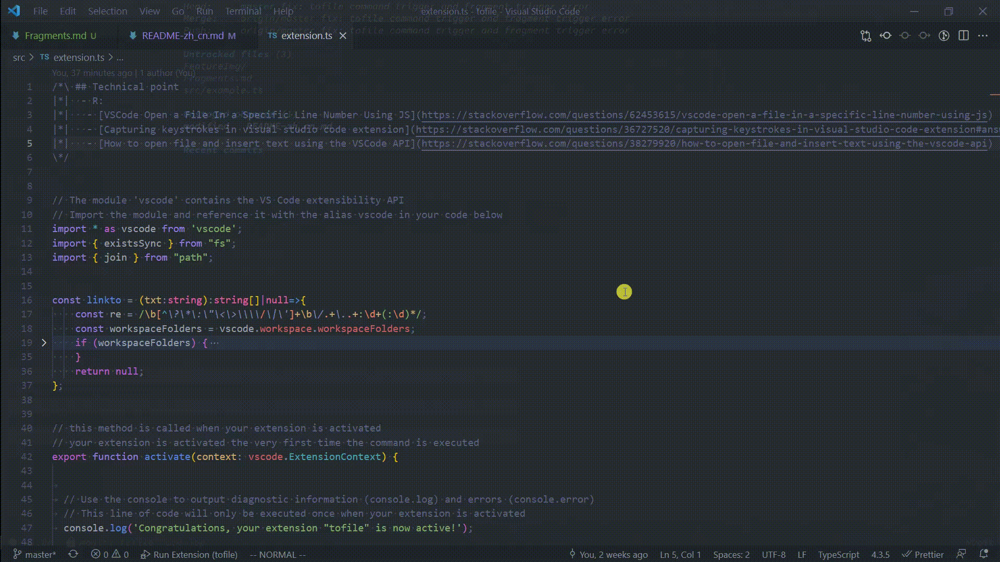

# tofile README
## English | [简体中文](https://github.com/WingDust/tofile/blob/master/README-zh_cn.md)

> This Plugin for script that generate Fragments markdown file content with file location
> This Plugin do thing is goto file location with current cursor


## self defined for easily to named
  - we will call below code block is `Fragment`
  ```txt
  /*\ ## Technical point
  |*|  - R:
  |*|   - [VSCode Open a File In a Specific Line Number Using JS](https://stackoverflow.com/questions/62453615/vscode-open-a-file-in-a-specific-line-number-using-js)
  |*|   - [Capturing keystrokes in visual studio code extension](https://stackoverflow.com/questions/36727520/capturing-keystrokes-in-visual-studio-code-extension#answer-36753622)
  |*|   - [How to open file and insert text using the VSCode API](https://stackoverflow.com/questions/38279920/how-to-open-file-and-insert-text-using-the-vscode-api)
  \*/
  ```
## Features
  1. When call `tofile` ,will detect relate file path string (like `src/a.ts:2` 2 mean line number) in current cursor line ,And try to jump to file .
  
  2. complete `Fragment`
  
    - knowed problem
      - In Normal type (include Vim Insert mode,but Vim Normal mode is work fine) to delete `|*|` will be
      
      - Why has this problem
        > 1. vscode don't support Multiple extensions registering the 'type' command, it cause only one extension can fine grain-size to control keystrokes event.

        > 2. I don't want make `tofile` complex
        - [Multiple extensions registering the 'type' command](https://github.com/microsoft/vscode/issues/13441)


## When you want to use fragment script in this repo, has Requirements
  - `src/script/fragment.ts` dependencies `ts-node` `ripgrep` 

## Notes 
  - When you 
    - **Can't use literal Regex**
      - Error example
      ```ts
      /*\ ## only match space
      |*|  '  \n'.match(/^\x20*/
      \*/
      ```
      - fix way
      - Error example
      ```ts
      /*\ ## only match space
      |*|  ```ts
      |*|  '  \n'.match(new RegExp(String.raw`^\x20*`))
      |*|  ```
      \*/
      ```

### Reference
  - [activationEvents.workspaceContains doesn't fire for directory](https://github.com/Microsoft/vscode/issues/2739)
  - [Insert a space after the line comment token and inside the block comments tokens](https://github.com/microsoft/vscode/blob/e5b6f39005e6029d6655e89313c8118bfda0913f/src/vs/editor/common/config/editorOptions.ts#L1136)
  - [vscode-box-comment](https://github.com/mattkenefick/vscode-box-comment)
  - [better-comments](https://github.com/aaron-bond/better-comments)
  - [comment-vscode](https://github.com/pouyakary/comment-vscode)

**Enjoy!**
